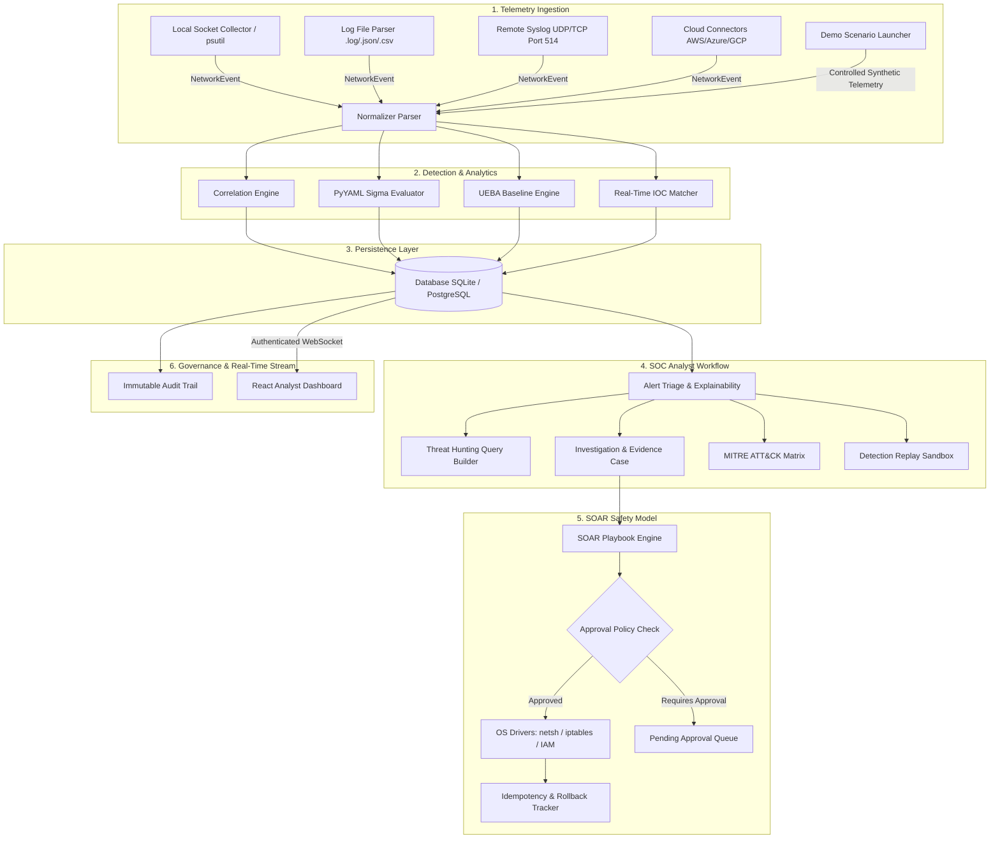

# NETWATCH — Enterprise Defensive SIEM, UEBA & SOAR Platform

NetWatch is an enterprise-oriented defensive SIEM, UEBA, Threat Hunting, MITRE ATT&CK Mapping, Detection Replay, Incident Evidence, Audit Logging, and automated incident response platform built with **FastAPI (Python)**, **SQLAlchemy**, **React (TypeScript)**, **Vite**, and **Tailwind CSS**.

---

## Executive Summary & Value Proposition

> **NetWatch bridges live network telemetry and log streams with explainable rule detection, statistical behavioral baselining, threat hunting, and approval-gated automated response actions.**

NetWatch processes **real network telemetry and real log streams**. It does NOT generate fake alerts, synthetic mock data, or fabricated integration responses. Every alert, anomaly, threat intelligence hit, threat hunt result, and automated response action is grounded in verified system data and deterministic mathematical logic.

---

## Platform Evolution (From Initial Scratch to Portfolio SOC)

NetWatch evolved through structured, incremental engineering cycles from a raw network socket watcher into a full-scale Defensive SOC & SIEM platform:

```
[Phase 0: Base Collector] ──► [Phase 1: Syslog & Threat Intel] ──► [Phase 2: UEBA & Baselines]
                                                                          │
[Phase 5: Defensive SOC & Hunting] ◄── [Phase 4: SOAR & Safety] ◄── [Phase 3: Sigma Sandbox]
```

- **Phase 0 (Initial Base Collector)**: Passive local socket monitoring (`psutil`), basic `.log`/`.json`/`.csv` file ingestion, SQLite persistence, and core REST API authentication.
- **Phase 1 (Enterprise Ingestion & Threat Intel)**: Non-blocking UDP/TCP Syslog receiver (Port 514), Cloud Connector API framework (AWS/Azure/GCP), and real-time IOC matching engine with AbuseIPDB, OTX, and MISP adapters.
- **Phase 2 (UEBA & Behavioral Analytics)**: Statistical baselining over 168-hour historical windows, explainable z-score anomaly detection, 24-hour half-life entity risk decay, and multi-stage campaign correlation (`CMP-2026-XXXX`).
- **Phase 3 (Sigma Engine & Sandbox)**: Production-grade PyYAML Sigma rule parser, standard field attribute mapping (`Image`, `CommandLine`, `User`), detection sandbox replay, and immutable rule versioning.
- **Phase 4 (SOAR Subsystem & Response Safety)**: Multi-step playbook execution engine, real OS firewall manipulation (Windows `netsh` / Linux `iptables`), approval queues (`ANALYST_APPROVAL`, `ADMIN_APPROVAL`), global Dry-Run toggle (`NETWATCH_SOAR_DRY_RUN=true`), and atomic state rollback (`BLOCK_IP` ↔ `UNBLOCK_IP`).
- **Phase 5 (Defensive SOC & Threat Hunting Platform)**: EQL-style Threat Hunting query builder (`/api/hunting/query`), MITRE ATT&CK 14-tactic visual heatmap (`/api/mitre/coverage`), forensic evidence attachment (`/api/investigations/{id}/evidence`), append-only SOC audit logging (`/api/audit`), and 1-click Demo Scenario launcher (5 controlled laboratory scenarios).

---

## Key Core Advantages & Technical Differentiators

| Advantage | NetWatch Implementation | Traditional / Superficial Projects |
| :--- | :--- | :--- |
| **Data Authenticity** | Real socket telemetry (`psutil`) & real log file parsers with path traversal safeguards | Hardcoded mock arrays, fake static counters, or random telemetry generators |
| **Explainable Risk Math** | Bounded (0–100) scoring with explicit point breakdowns (base severity + velocity + asset criticality + UEBA z-score) | Black-box opacity or arbitrary random numbers |
| **Response Safety Model** | Multi-tiered approval gates, global Dry-Run toggles, loopback (`127.0.0.1`) protection, & atomic state rollbacks | Unchecked script execution that risks crashing production or locking out host access |
| **Sigma Engine Integration** | Native PyYAML parser with condition evaluators (`selection`, `wildcards`, `regex`) and detection sandbox replay | Static text regex matching or unvalidated rules |
| **Threat Hunting & MITRE** | EQL-style structured query builder and dynamic 14-tactic heatmap displaying active rule coverage depth | Static documentation without interactive query capabilities |
| **Verification & Quality** | 50/50 passing backend pytest tests & production Vite build (`1510 modules transformed`) | Untested codebases or broken build scripts |

---

## Detailed 12-Step SOC Analyst Workflow

NetWatch organizes analyst operations into a continuous, end-to-end defensive lifecycle:

```
TELEMETRY
    ↓
NORMALIZATION
    ↓
DETECTION
    ↓
ALERT
    ↓
TRIAGE
    ↓
INVESTIGATION
    ↓
THREAT HUNTING
    ↓
MITRE ATT&CK
    ↓
IOC ENRICHMENT
    ↓
CONTROLLED RESPONSE
    ↓
AUDIT
    ↓
INCIDENT REPORT
```

1. **Telemetry Ingestion**: Ingests live local socket telemetry, structured log files, remote Syslog feeds, or controlled lab demo scenarios.
2. **Field Normalization**: Normalizes raw data into standardized `NetworkEvent` records containing timestamps, source/destination IPs/ports, protocol, user, process, and command line attributes.
3. **Multi-Engine Detection**: Evaluates events concurrently across rule correlation windows, PyYAML Sigma rules, UEBA statistical baselines, and real-time IOC lists.
4. **Alert Deduplication & Risk Calculation**: Aggregates repeated alerts within 300s sliding windows and calculates evidence-backed risk scores (0–100).
5. **Alert Triage & Explainability**: Analysts inspect the triage queue (`/alerts`) and open the Alert Explainability Modal to review mathematical risk factors and rule metadata.
6. **Investigation Case Creation**: Analysts convert critical alerts into formal investigation cases (`/investigations`), generating an initial timeline and assigning ownership.
7. **Threat Hunting & Pivot Analysis**: Analysts execute structured EQL queries (`/hunting`) across raw telemetry to identify lateral movement or additional compromised hosts.
8. **MITRE ATT&CK Matrix Mapping**: Detections map dynamically to the 14-tactic enterprise matrix (`/mitre`), highlighting technique coverage and gaps.
9. **IOC Threat Intel Enrichment**: Evaluates IP reputations and domain indicators against AbuseIPDB, OTX, and MISP threat intelligence caches.
10. **Controlled SOAR Response**: Triggers playbooks with Dry-Run validation (`NETWATCH_SOAR_DRY_RUN=true`) and approval gating for host isolation or firewall block rules.
11. **Immutable Audit Logging**: System records an append-only audit entry (`/audit`) detailing actor identity, action name, timestamp, and payload diffs.
12. **Incident Summary Report Export**: Analysts assign a final verdict (`TRUE_POSITIVE`, `FALSE_POSITIVE`), close the case, and export a formatted executive report.

---

## Verified Portfolio Status

- **Backend Automated Test Suite:** `50/50 PASSED` (`cd backend; python -m pytest tests/ -v`)
- **Frontend Production Build:** `SUCCESSFUL` (`cd frontend; npx vite build`)
- **API Specification:** Interactive Swagger docs at `http://localhost:8000/docs`
- **Authentication & Security:** JWT OAuth2 Bearer Tokens, Bcrypt Hashing, RBAC Middleware (`ADMIN`, `ANALYST`, `VIEWER`), Last-Admin Protection.

---

## Architecture Diagram



---

## Controlled Laboratory Demo Scenarios

NetWatch includes 5 controlled, offline laboratory scenarios for demonstration and testing purposes. These scenarios stream synthetic telemetry into local memory/database without targeting external systems:

1. **`ssh_brute_force`** (Primary Demo): Rapid SSH authentication failures followed by successful intrusion on Port 22.
2. **`suspicious_login`**: Off-hours authentication attempt from an anomalous geographic region.
3. **`c2_beacon`**: Periodic outbound HTTP GET requests matching C2 beacon timing patterns.
4. **`port_scan`**: Sequential TCP connection attempts across multiple ports on a single host.
5. **`dns_anomaly`**: High-entropy DNS queries indicating potential covert tunnel or exfiltration.

---

## Technology Stack

- **Backend Framework:** Python 3.10+, FastAPI, Uvicorn
- **Database & ORM:** SQLite / PostgreSQL, SQLAlchemy ORM
- **Rule Engine & Validation:** PyYAML, Pydantic v2
- **Frontend Framework:** React 18, TypeScript, Vite, Tailwind CSS
- **Visualization:** Recharts, Lucide Icons
- **Real-Time Communication:** WebSockets (`/ws/events`)
- **Testing:** Pytest, pytest-asyncio, HTTPX

---

## System Requirements & Installation

### Prerequisites
- Python 3.10+
- Node.js >= 18.0.0, npm >= 9.0.0
- Git

### Installation Steps

1. **Clone Repository & Setup Virtual Environment**:
   ```bash
   git clone https://github.com/koppineeedi/NetWatch-Network-Security-Monitoring-Suspicious-Activity-Detection-Platform.git netwatch
   cd netwatch
   python -m venv venv
   .\venv\Scripts\Activate.ps1   # Windows PowerShell
   # source venv/bin/activate    # Linux / macOS
   pip install -r backend/requirements.txt
   cp .env.example .env
   ```

2. **Initialize Database & Seed Admin Account**:
   ```bash
   python -m backend.app.scripts.create_admin
   python backend/app/scripts/config_check.py
   ```

3. **Build & Test Frontend**:
   ```bash
   cd frontend
   npm install
   npx vite build
   cd ..
   ```

4. **Start Backend API Server**:
   ```bash
   cd backend
   python -m uvicorn app.main:app --host 0.0.0.0 --port 8000 --reload
   ```

- REST API Base URL: `http://localhost:8000`
- Interactive Swagger Specs: `http://localhost:8000/docs`
- Health Probe: `http://localhost:8000/health`
- Frontend Development Server: `http://localhost:5173`

---

## Automated Test Verification

Run the complete backend test suite:
```bash
cd backend
python -m pytest tests/ -v
# Output: 50 passed in 22.96s
```

Run the production frontend build:
```bash
cd frontend
npx vite build
# Output: ✓ 1510 modules transformed
```

---

## Technical Documentation & References

- [3-Minute SOC Demo Presentation Script](docs/DEMO_SCRIPT.md)
- [Technical Interview & Architecture Cheat Sheet](docs/INTERVIEW_GUIDE.md)
- [Visual Screenshot Guide](docs/SCREENSHOT_GUIDE.md)
- [System Architecture](docs/ARCHITECTURE.md)
- [Threat Model Specification](THREAT_MODEL.md)
- [Security Hardening Guide](docs/SECURITY_HARDENING.md)

---

## Known Limitations & Production Roadmap

- **Database Storage:** Default SQLite storage is ideal for single-instance testing. Production deployments should use PostgreSQL with connection pooling.
- **Horizontal Scaling:** High-volume multi-gigabit log ingestion requires replacing the in-process queue with Apache Kafka or RabbitMQ.
- **External Connectors:** Cloud Connectors (AWS/Azure/GCP) and Threat Intelligence APIs default to `NOT_CONFIGURED` until active credentials are set in `.env`.

---

## Technical Portfolio & Interview Summary

NetWatch was designed as a production-grade defensive security engineering project to demonstrate mastery in SIEM telemetry parsing, rule correlation, UEBA anomaly detection, threat hunting, dynamic MITRE ATT&CK mapping, SOAR safety model design, and REST/WebSocket API development. All 50 backend tests pass cleanly, and the frontend builds with zero errors.

---

## License & Defensive Operations Policy

This software is strictly intended for defensive cybersecurity operations, security monitoring, threat detection, and authorized educational laboratory research.
