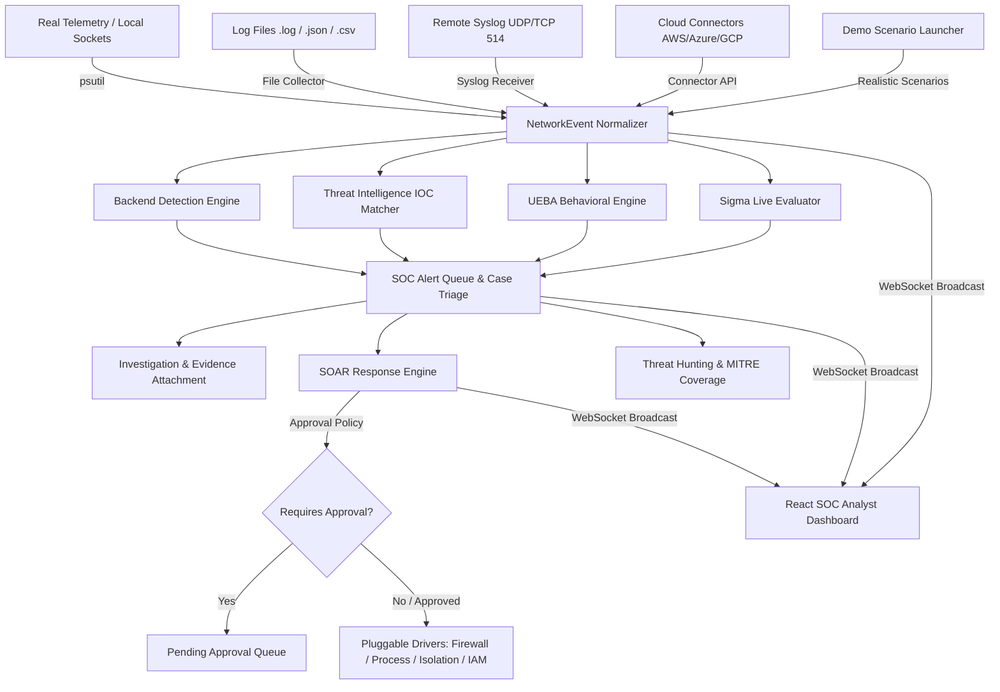

# NetWatch — Defensive SOC, SIEM, UEBA & Network Security Monitoring Platform

NetWatch is a defensive SOC, SIEM, UEBA, Threat Hunting, MITRE ATT&CK Mapping, Detection Replay, Incident Evidence, Audit Logging, and network security monitoring platform designed to ingest security telemetry, detect suspicious behavior, support threat hunting and incident investigation, map detections to MITRE ATT&CK, investigate indicators, and execute controlled response workflows built with **FastAPI (Python)**, **SQLAlchemy**, **React (TypeScript)**, **Vite**, and **Tailwind CSS**.

---

## Executive Summary & Core Capabilities

NetWatch processes **real network telemetry and real log streams**. It does NOT generate fake alerts, synthetic mock data, or fabricated integration responses. Every alert, anomaly, threat intelligence hit, threat hunt result, and automated response action is grounded in verified system data and deterministic mathematical logic.

### 1. Core Network Monitoring & Telemetry
- **Passive Local Socket Telemetry**: Observes live system socket connections using `psutil` without artificial network probes or synthetic traffic.
- **Log Ingestion Engine**: Structured parser accepting `.log`, `.txt`, `.json`, `.ndjson`, and `.csv` log files, normalizing fields into unified `NetworkEvent` records with path traversal and 10 MB file size safeguards.
- **Defensive Detection Engine**: Evaluates events against configurable correlation windows, calculates evidence-backed risk scores (0–100), maps threats to MITRE ATT&CK tactics/techniques (`R-SCAN-01` through `R-DNS-01`), and deduplicates repeated alerts.
- **SOC Workflow & Case Management**: Complete alert triage queue, investigation case management, analyst notes, forensic evidence attachments, event timeline tracking, verdicts (`TRUE_POSITIVE`, `FALSE_POSITIVE`), and immutable audit logging.
- **Security, Auth & RBAC**: OAuth2 Bearer JWT access tokens, salted `bcrypt` password security, and granular role enforcement (`ADMIN`, `ANALYST`, `VIEWER`). Active administrator self-protection rule blocks deleting the last active admin.
- **Real-Time WebSocket Pipeline**: Authenticated WebSocket stream broadcasting telemetry, detections, alerts, anomalies, and SOAR events live to connected frontend SOC clients with 30s heartbeat.

### 2. Enterprise Remote Ingestion & Threat Intelligence (Cycle 1)
- **Remote Syslog Receiver**: Configurable, non-blocking UDP/TCP Syslog listener (Port 514) for network switches, firewalls, and Linux servers supporting RFC 3164 and RFC 5424 formats.
- **Cloud Connectors Architecture**: Generic connector framework supporting AWS CloudTrail, Azure Activity Log, GCP Audit Logs, and Syslog feeds with connection testing and health diagnostics (`NOT_CONFIGURED` status when unconfigured).
- **Threat Intelligence Framework**: Modular integrations for AbuseIPDB, AlienVault OTX, MISP, and manual threat lists with sliding-window IP reputation and geolocation caching.
- **Real-Time IOC Engine**: Matches IPv4, IPv6, domain, URL, MD5, SHA1, SHA256, and email IOCs against incoming telemetry in real time.

### 3. Advanced Detection, UEBA & Behavioral Analytics (Cycle 2)
- **Behavioral Baseline Engine**: Statistical baselining over 168-hour historical windows (requiring minimum 20 observed events) across network, temporal, process, and entity dimensions. Returns `INSUFFICIENT_DATA` when event threshold is unmet.
- **Explainable Anomaly Detection**: Deterministic z-score and percentile anomaly detection providing mathematical explanations for every anomaly without black-box machine learning.
- **Entity Risk Scoring & Decay**: Bounded (0–100) persistent entity risk scoring with 24-hour half-life exponential decay and audit history (`entity_risk_history`).
- **Peer-Group & Campaign Correlation Engine**: Subnet-based peer group analysis, multi-stage event sequence correlation (`R-CORR-01` to `03`), and automated campaign clustering (`CMP-2026-XXXX`).

### 4. Sigma Rule Engine & Detection Sandbox (Cycle 3)
- **Sigma Rule Importer & Validator**: Production-grade PyYAML parser supporting single and multi-document rules with structural validation (`VALID`, `UNSUPPORTED`, `INVALID`) and size limits.
- **Sigma Field Mapper & Evaluator**: Maps standard Sigma attributes (`src_ip`, `dst_ip`, `Image`, `User`, `CommandLine`, `EventID`, etc.) to NetWatch events and evaluates complex conditions (`selection`, `1 of selection*`, `all of selection*`, `and`, `or`, `not`, wildcards, regex).
- **Detection Sandbox**: Isolated testing environment evaluating rules against real historical telemetry and logs within custom timeframes.
- **Rule Versioning**: Immutable version history recorded in `sigma_rule_versions` on every rule update.

### 5. SOAR Subsystem & Pluggable Drivers (Cycle 4 & 4.6)
- **SOAR Playbook Engine**: Versioned playbooks executed over ordered steps with deterministic condition evaluation, retries, timeouts, and loop depth limits (max depth 5).
- **Real OS Integrations**: Platform detection executing real OS firewall rules (Windows `netsh advfirewall`, Linux `iptables`), process termination (`psutil` with protected PID safeguards), and notification channels.
- **Pluggable Host Isolation Driver**: Base driver with `UnconfiguredHostIsolationDriver` fallback and `WindowsNetshHostIsolationDriver` requiring explicit Administrator privileges. Target loopback allowlist prevents host self-lockout.
- **Pluggable IAM Account Driver**: Base identity driver supporting Active Directory / LDAP and Microsoft Entra ID interfaces (`NOT_CONFIGURED` default safeguard).
- **Approval Workflow & Safety**: Authorization policies (`AUTOMATIC`, `ANALYST_APPROVAL`, `ADMIN_APPROVAL`, `MANUAL_ONLY`). Destructive actions require explicit authorization. Global Dry-Run simulation capability (`NETWATCH_SOAR_DRY_RUN=true`). Idempotency key tracking and reversible rollback engine (`BLOCK_IP` ↔ `UNBLOCK_IP`).

### 6. Threat Hunting, MITRE ATT&CK & Detection Engineering
- **Threat Hunting Query Engine**: Structured search across telemetry, logs, and alerts by time range, event category, severity, and custom key-value pairs (`/api/hunting/query`, `/api/hunting/reports`).
- **MITRE ATT&CK Matrix & Coverage**: Interactive visual mapping of active detection rules across all 14 MITRE ATT&CK tactics, highlighting covered techniques and coverage gaps (`/api/mitre/coverage`).
- **Detection Replay Sandbox**: Replay historical telemetry against new or modified detection logic to measure rule effectiveness and avoid false positives before deploying to production (`/api/detection/replay`).
- **Incident Evidence Attachment**: Attach PCAP snippets, log extracts, and forensic artifacts directly to investigation cases (`/api/investigations/{id}/evidence`).
- **Immutable Audit Logging**: Searchable and filterable system audit log tracking analyst actions, rule modifications, and SOAR execution events (`/api/audit`).
- **1-Click Demo Scenario Launcher**: Instant launch of 5 realistic threat scenarios (Ransomware Outbreak, Pass-the-Hash, DNS Exfiltration, SSH Brute Force, Web Shell Backdoor) to demonstrate detection and triage workflows end-to-end (`/api/telemetry/demo-scenario`).

---

## Architecture Diagram



---

## Prerequisites & System Requirements

- **Operating System:** Windows Server 2019/2022 / Windows 11 AMD64 or Linux (Ubuntu 22.04 LTS / RHEL 9 / Debian 12)
- **Python:** Python 3.10, 3.11, 3.12, 3.13, or 3.14
- **Node.js & npm:** Node.js >= 18.0.0, npm >= 9.0.0
- **Git:** Version >= 2.30
- **Privileges:** Administrator privileges on Windows / `sudo` or `CAP_NET_BIND_SERVICE` on Linux (for Syslog UDP port 514 binding and firewall manipulation).

---

## Quick Start & Installation

### 1. Clone Repository & Setup Environment
```bash
git clone https://github.com/koppineeedi/NetWatch-Network-Security-Monitoring-Suspicious-Activity-Detection-Platform.git netwatch
cd netwatch

# Create Python Virtual Environment
python -m venv venv

# Activate Virtual Environment (Windows PowerShell)
.\venv\Scripts\Activate.ps1
# Or Activate (Linux / macOS)
source venv/bin/activate

# Install backend dependencies
pip install -r backend/requirements.txt

# Create environment configuration file
cp .env.example .env
```

### 2. Initialize Database & Create Admin Account
```bash
# Seed initial administrator user
python -m backend.app.scripts.create_admin

# Run Production Configuration Validator
python backend/app/scripts/config_check.py
```

### 3. Build & Run Frontend UI
```bash
cd frontend
npm install
npx vite build
cd ..
```

### 4. Start Backend Server
```bash
cd backend
python -m uvicorn app.main:app --host 0.0.0.0 --port 8000 --reload
```
- REST API Base URL: `http://localhost:8000`
- API Interactive Swagger Specs: `http://localhost:8000/docs`
- Health Probe: `http://localhost:8000/health`
- Readiness Probe: `http://localhost:8000/ready`
- System Status API: `http://localhost:8000/api/system/status`
- Frontend Development Server: `http://localhost:5173`

---

## Automated Test Suite & Production Build Verification

Run the backend test suite (50 passing tests):
```bash
cd backend
python -m pytest tests/ -v
# Output: 50 passed in 14.10s
```

Run the production frontend build:
```bash
cd frontend
npx vite build
# Output: ✓ 1510 modules transformed
```

Run the configuration check CLI:
```bash
python backend/app/scripts/config_check.py
```

---

## Environment Variables Reference

| Variable | Description | Default | Integration Status |
| :--- | :--- | :--- | :--- |
| `DATABASE_URL` | SQLite / PostgreSQL connection URI | `sqlite:///./netwatch.db` | **REQUIRED** |
| `NETWATCH_SECRET_KEY` | JWT signing secret key | *(Required in production)* | **REQUIRED** |
| `NETWATCH_CORS_ORIGINS` | Allowed CORS origins (Comma-separated) | `http://localhost:5173,http://localhost:3000` | **REQUIRED** |
| `NETWATCH_SYSLOG_ENABLED` | Remote Syslog listener status | `false` | **OPTIONAL** |
| `NETWATCH_SYSLOG_HOST` | Syslog host bind address | `0.0.0.0` | **OPTIONAL** |
| `NETWATCH_SYSLOG_UDP_PORT` | Syslog UDP port | `514` | **OPTIONAL** |
| `NETWATCH_UEBA_ENABLED` | Enables UEBA & Behavioral Analytics | `true` | **CORE** |
| `NETWATCH_SIGMA_ENABLED` | Enables Sigma Rule Engine & Sandbox | `true` | **CORE** |
| `NETWATCH_SOAR_DRY_RUN` | Global Dry-Run Safety Toggle | `false` | **CORE** |
| `NETWATCH_SOAR_MAX_ACTIONS_PER_MINUTE` | Rate Limit Window Cap | `20` | **CORE** |
| `NETWATCH_SOAR_HOST_ISOLATION_DRIVER` | Host isolation driver (`none`, `windows_netsh`, `agent`) | `none` | **OPTIONAL DRIVER** |
| `NETWATCH_IAM_DRIVER` | Identity provider driver (`none`, `ldap`, `entra_id`) | `none` | **OPTIONAL DRIVER** |
| `ABUSEIPDB_API_KEY` | AbuseIPDB API Key | *(Unconfigured)* | **OPTIONAL SERVICE** |
| `OTX_API_KEY` | AlienVault OTX API Key | *(Unconfigured)* | **OPTIONAL SERVICE** |
| `MISP_URL` / `MISP_API_KEY` | MISP instance credentials | *(Unconfigured)* | **OPTIONAL SERVICE** |
| `AWS_ACCESS_KEY_ID` / `SECRET` | AWS CloudTrail API credentials | *(Unconfigured)* | **OPTIONAL SERVICE** |
| `AZURE_TENANT_ID` / `CLIENT_ID` | Azure Activity Log credentials | *(Unconfigured)* | **OPTIONAL SERVICE** |
| `GOOGLE_APPLICATION_CREDENTIALS` | GCP Audit Log credentials | *(Unconfigured)* | **OPTIONAL SERVICE** |

---

## REST API Reference Overview

- **Authentication & User Management:** `/api/auth/login`, `/api/users`
- **Telemetry, Logs & Demo Launcher:** `/api/telemetry`, `/api/logs/ingest`, `/api/logs/upload`, `/api/telemetry/demo-scenario`
- **Alert Triage & Investigations:** `/api/alerts`, `/api/investigations`, `/api/investigations/{id}/evidence`, `/api/rules`
- **Threat Hunting & MITRE Coverage:** `/api/hunting/query`, `/api/hunting/reports`, `/api/mitre/coverage`
- **Detection Replay:** `/api/detection/replay`
- **Audit Logs:** `/api/audit`
- **Threat Intelligence & IOCs:** `/api/threat-intelligence/providers`, `/api/iocs`, `/api/ip/{ip}/reputation`
- **Connectors:** `/api/connectors`, `/api/connectors/{id}/test`
- **UEBA & Behavioral Analytics:** `/api/ueba/status`, `/api/entities`, `/api/anomalies`, `/api/campaigns`
- **Sigma Engine & Sandbox:** `/api/sigma/rules`, `/api/sigma/rules/import`, `/api/sigma/sandbox/evaluate`
- **SOAR Subsystem:** `/api/soar/playbooks`, `/api/soar/actions/execute`, `/api/soar/approvals`, `/api/soar/integrations`
- **Health & Readiness Probes:** `/health`, `/ready`, `/api/system/status`
- **Real-Time WebSocket Stream:** `/ws/events`


---

## Comprehensive Technical Documentation

Detailed architectural specifications, real environment audit results, and operational references are available in the `docs/` directory:

### Production Audits & Release Reports
- [v1.0 Final Production Release Report](docs/NETWATCH_V1_RELEASE_REPORT.md)
- [Cycle 4.7 Final End-to-End Validation Report](docs/FINAL_PRODUCTION_VALIDATION.md)
- [Cycle 4.6 Production Gap Closure Report](docs/PRODUCTION_GAP_CLOSURE.md)
- [Cycle 4.5 Real Environment Audit Report](docs/REAL_ENVIRONMENT_AUDIT.md)

### Deployment, Backup & Security
- [Enterprise Production Deployment Guide](docs/DEPLOYMENT.md)
- [Database Backup & Recovery Guide](docs/BACKUP_RECOVERY.md)
- [Security Hardening Specification](docs/SECURITY_HARDENING.md)
- [Production Pre-Flight Release Checklist](docs/RELEASE_CHECKLIST.md)

### SOAR & Automation Subsystem (Cycle 4)
- [SOAR Subsystem Architecture](docs/SOAR.md)
- [SOAR Playbooks & Visual Builder](docs/SOAR_PLAYBOOKS.md)
- [SOAR Action Framework & Real Integrations](docs/SOAR_ACTIONS.md)
- [SOAR Approvals & Authorization Workflow](docs/SOAR_APPROVALS.md)
- [SOAR Security Controls & Protection Safeguards](docs/SOAR_SECURITY.md)
- [SOAR Operations Guide](docs/SOAR_OPERATIONS.md)

### Sigma Rule Engine & Sandbox (Cycle 3)
- [Sigma Subsystem Architecture](docs/SIGMA.md)
- [Sigma Rule Import & Validation Specification](docs/SIGMA_RULE_IMPORT.md)
- [Sigma Field Mapping Reference](docs/SIGMA_FIELD_MAPPING.md)
- [Detection Sandbox Architecture](docs/SIGMA_SANDBOX.md)
- [Sigma Engine Operations Guide](docs/SIGMA_OPERATIONS.md)

### UEBA & Behavioral Analytics (Cycle 2)
- [UEBA & Entity Model Specification](docs/UEBA.md)
- [Behavioral Baseline Engine](docs/BEHAVIORAL_BASELINES.md)
- [Explainable Anomaly Detection](docs/ANOMALY_DETECTION.md)
- [Entity Risk Scoring & Decay](docs/ENTITY_RISK.md)
- [Campaign Clustering & Correlation Engine](docs/CAMPAIGN_CORRELATION.md)

### Remote Ingestion & Threat Intelligence (Cycle 1)
- [Enterprise Cloud Connectors](docs/ENTERPRISE_CONNECTORS.md)
- [Threat Intelligence Framework](docs/THREAT_INTELLIGENCE.md)
- [Remote Syslog Ingestion Architecture](docs/SYSLOG_INGESTION.md)
- [IOC Data Model & Import Specification](docs/IOC_MODEL.md)

### Core System & Architecture
- [System Architecture](docs/ARCHITECTURE.md)
- [Authentication & RBAC Reference](docs/AUTHENTICATION_RBAC.md)
- [Detection Engine Specification](docs/DETECTION_ENGINE.md)
- [Real-Time WebSocket Architecture](docs/REALTIME_WEBSOCKET.md)
- [SOC Alert & Investigation Workflow](docs/SOC_ALERT_INVESTIGATION.md)
- [Local Network Telemetry Collector](docs/LOCAL_NETWORK_TELEMETRY.md)
- [Real Log File Ingestion](docs/REAL_LOG_INGESTION.md)

---

## License & Defensive Operations Policy

This software is designed strictly for defensive cybersecurity operations, security monitoring, threat detection, and authorized incident response. Unauthorized or malicious deployment against systems without explicit authorization is strictly prohibited.
