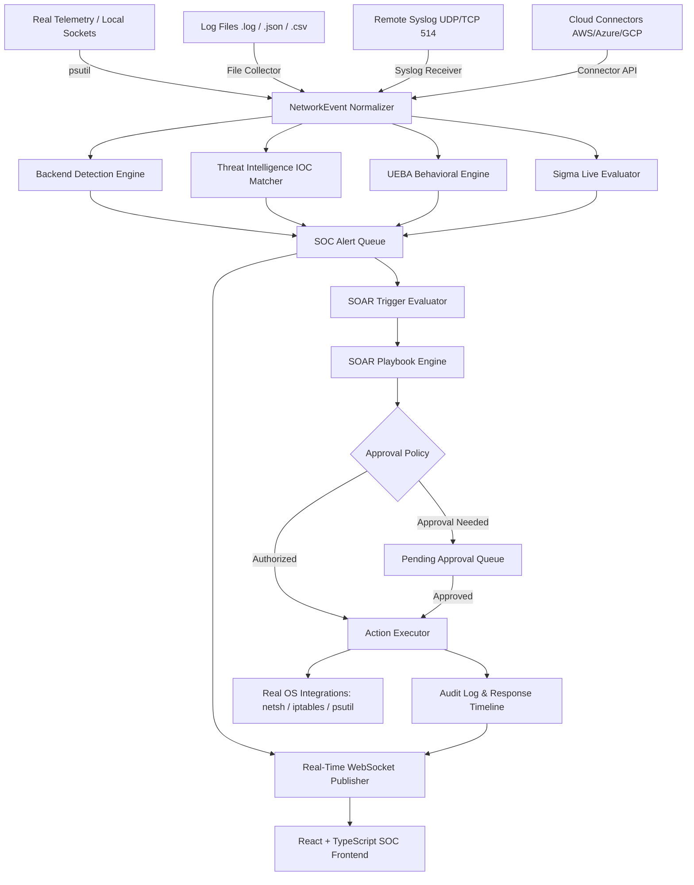

# NetWatch — Enterprise Defensive SIEM, UEBA, Sigma & SOAR Platform

NetWatch is an authoritative, evidence-backed Defensive Security Information and Event Management (SIEM), User and Entity Behavior Analytics (UEBA), Sigma Detection Engine, and Security Orchestration, Automation, and Response (SOAR) Analyst Platform built with **FastAPI (Python)**, **SQLAlchemy**, **React (TypeScript)**, **Vite**, and **Tailwind CSS**.

---

## Executive Summary & System Capabilities

NetWatch processes **REAL network telemetry and real log streams**. It does NOT generate fake alerts or synthetic mock data. Every alert, anomaly, threat intelligence hit, and automated response action is grounded in verified system data and deterministic mathematical logic.

### 1. Core Network Monitoring & Telemetry
- **Passive Local Socket Telemetry**: Observes live system socket connections using `psutil` without artificial network probes or synthetic traffic.
- **Log Ingestion Engine**: Structured parser accepting `.log`, `.txt`, `.json`, and `.csv` log files, normalizing fields into unified `NetworkEvent` records.
- **Defensive Detection Engine**: Evaluates events against configurable correlation windows, calculates evidence-backed risk scores (0–100), maps threats to MITRE ATT&CK tactics/techniques, and deduplicates repeated alerts.
- **SOC Workflow & Case Management**: Complete alert triage queue, investigation case management, analyst notes, event timeline tracking, verdicts (`TRUE_POSITIVE`, `FALSE_POSITIVE`), and audit logging.
- **Security, Auth & RBAC**: JWT access tokens, Argon2id password security, and granular role enforcement (`ADMIN`, `ANALYST`, `VIEWER`).
- **Real-Time WebSocket Pipeline**: Authenticated WebSocket stream broadcasting telemetry, detections, alerts, anomalies, and SOAR events live to connected frontend SOC clients.

### 2. Enterprise Remote Ingestion & Threat Intelligence (Enhancement Cycle 1)
- **Remote Syslog Receiver**: Configurable, non-blocking UDP/TCP Syslog listener (Port 514) for network switches, firewalls, and Linux servers.
- **Cloud Connectors Architecture**: Generic connector framework supporting AWS CloudTrail, Azure Activity Log, GCP Audit Logs, and Syslog feeds with connection testing and health diagnostics.
- **Threat Intelligence Framework**: Modular integrations for AbuseIPDB, AlienVault OTX, MISP, and manual threat lists with sliding-window IP reputation and geolocation caching.

### 3. Advanced Detection, UEBA & Behavioral Analytics (Enhancement Cycle 2)
- **Behavioral Baseline Engine**: Statistical baselining over 168-hour historical windows (requiring minimum 20 observed events) across network, temporal, process, and entity dimensions.
- **Explainable Anomaly Detection**: Deterministic z-score and percentile anomaly detection providing mathematical explanations for every anomaly without black-box machine learning.
- **Entity Risk Scoring & Decay**: Bounded (0–100) persistent entity risk scoring with 24-hour half-life exponential decay and audit history (`entity_risk_history`).
- **Peer-Group & Campaign Correlation Engine**: Subnet-based peer group analysis, multi-stage event sequence correlation (`R-CORR-01` to `03`), and automated campaign clustering (`CMP-2026-XXXX`).

### 4. Sigma Rule Engine & Detection Sandbox (Enhancement Cycle 3)
- **Sigma Rule Importer & Validator**: Production-grade PyYAML parser supporting single and multi-document rules with structural validation (`VALID`, `UNSUPPORTED`, `INVALID`) and size limits.
- **Sigma Field Mapper & Evaluator**: Maps standard Sigma attributes (`src_ip`, `dst_ip`, `Image`, `User`, `CommandLine`, `EventID`, etc.) to NetWatch events and evaluates complex conditions (`selection`, `1 of selection*`, `all of selection*`, `and`, `or`, `not`, wildcards, regex).
- **Detection Sandbox**: Isolated testing environment evaluating rules against real historical telemetry and logs within custom timeframes (returns `INSUFFICIENT_DATA` when no historical events match).
- **Rule Versioning**: Immutable version history recorded in `sigma_rule_versions` on every rule update.

### 5. SOAR & Automated Incident Response (Enhancement Cycle 4)
- **SOAR Playbook Engine**: Versioned playbooks executed over ordered steps with deterministic condition evaluation, retries, timeouts, and loop depth limits.
- **Real OS Integrations**: Platform detection executing real OS firewall rules (Windows `netsh advfirewall`, Linux `iptables`), process termination (`psutil` with protected PID safeguards), and notification channels. Zero fake execution policy.
- **Approval Workflow**: Authorization policies (`AUTOMATIC`, `ANALYST_APPROVAL`, `ADMIN_APPROVAL`, `MANUAL_ONLY`). Destructive actions require explicit authorization.
- **Dry-Run Mode**: Full simulation capability (`NETWATCH_SOAR_DRY_RUN=true` or `--dry-run`) producing complete execution records without modifying production OS state.
- **Rollback Engine**: Reversible action rollback (`BLOCK_IP` → `UNBLOCK_IP`, `ISOLATE_HOST` → `RESTORE_HOST`) with audit logging.
- **Safety Controls**: Protection allowlists (`127.0.0.1`, `::1`, default gateways), protected process list (`init`, `svchost.exe`, `python`, `uvicorn`, NetWatch server PID), rate limiting (`20 actions/min`), and idempotency protection.

---

## Architecture Diagram



---

## Directory Structure

```
netwatch/
├── backend/
│   ├── app/
│   │   ├── analytics/          # UEBA, Baselines, Entity Risk & Campaigns
│   │   ├── api/                # REST API Routers (Auth, Events, Alerts, SOAR, Sigma, TI)
│   │   ├── collectors/         # Local Telemetry, Log File & Syslog Collectors
│   │   ├── connectors/         # AWS, Azure & GCP Cloud Connectors
│   │   ├── core/               # Security & JWT Authentication
│   │   ├── database/           # SQLAlchemy Engine & DB Session Connection
│   │   ├── detection/          # Detection Rules, Risk Calculator & Correlator
│   │   ├── models/             # SQLAlchemy Data Models
│   │   ├── parsers/            # Syslog & File Log Parsers
│   │   ├── realtime/           # WebSocket Manager & Event Publisher
│   │   ├── schemas/            # Pydantic Schemas
│   │   ├── sigma/              # Sigma Parser, Validator, Mapper, Evaluator & Sandbox
│   │   ├── soar/               # SOAR Engine, Playbooks, Actions, Integrations & Approvals
│   │   ├── threat_intelligence/# AbuseIPDB, OTX, MISP & IOC Engine
│   │   └── main.py             # FastAPI App Entrypoint
├── frontend/
│   ├── src/
│   │   ├── components/         # Navbar, Sidebar & Shared UI Elements
│   │   ├── pages/              # Dashboard, Alerts, UEBA, Sigma, SOAR, Connectors, etc.
│   │   ├── services/           # API Service Client (Fetch / REST)
│   │   ├── types/              # TypeScript Interface Definitions
│   │   ├── App.tsx             # Main React Component & Routing
│   │   └── main.tsx            # React DOM Entrypoint
├── docs/                       # Architectural & Operational Documentation (26 Markdown Files)
├── tests/                      # Automated Pytest Test Suite (42 Test Files)
├── .env.example                # Environment Variable Reference Configuration
├── README.md                   # System Documentation
└── package.json / requirements.txt
```

---

## Quick Start (Development & Deployment)

### 1. Prerequisites
- Python 3.10+
- Node.js 18+ and npm
- Operating System: Windows or Linux

### 2. Environment Configuration
Copy `.env.example` to `.env`:
```bash
cp .env.example .env
```

### 3. Bootstrap Administrator Account
Run the administrative bootstrap script to create the initial superuser:
```bash
python -m app.scripts.create_admin
```

### 4. Start FastAPI Backend & WebSocket Server
```bash
cd backend
python -m uvicorn app.main:app --host 127.0.0.1 --port 8000 --reload
```
- **Interactive REST API Documentation (Swagger)**: `http://127.0.0.1:8000/docs`
- **WebSocket Event Stream**: `ws://127.0.0.1:8000/ws/events?token=<jwt_access_token>`

### 5. Start React + Vite Frontend Application
In a separate terminal:
```bash
cd frontend
npm install
npm run dev
```
- **SOC Web Dashboard**: `http://127.0.0.1:5173/`

---

## Automated Test Suites & Production Verification

Run the full automated test suite covering all 42 test files across Core, Enhancement Cycle 1, Cycle 2, Cycle 3, and Cycle 4:

```bash
# Run full pytest test suite
python -m pytest tests/ -v

# Python backend compilation check
python -m compileall backend/app

# Build production bundle for React frontend
cd frontend && npx vite build
```

---

## Comprehensive Technical Documentation Index

Detailed architectural specs and operational references are available in the `docs/` folder:

### SOAR & Automation (Cycle 4)
- [SOAR Subsystem Architecture](docs/SOAR.md)
- [SOAR Playbooks & Visual Builder](docs/SOAR_PLAYBOOKS.md)
- [SOAR Action Framework & Real Integrations](docs/SOAR_ACTIONS.md)
- [SOAR Approvals & Authorization Workflow](docs/SOAR_APPROVALS.md)
- [SOAR Security Controls & Protection Safeguards](docs/SOAR_SECURITY.md)
- [SOAR Operations Guide](docs/SOAR_OPERATIONS.md)

### Sigma Engine & Sandbox (Cycle 3)
- [Sigma Subsystem Architecture](docs/SIGMA.md)
- [Sigma Rule Import & Validation Specification](docs/SIGMA_RULE_IMPORT.md)
- [Sigma Field Mapping Reference](docs/SIGMA_FIELD_MAPPING.md)
- [Detection Sandbox Architecture](docs/SIGMA_SANDBOX.md)
- [Sigma Engine Operations Guide](docs/SIGMA_OPERATIONS.md)

### UEBA & Behavioral Analytics (Cycle 2)
- [UEBA & Entity Model Specification](docs/UEBA.md)
- [Behavioral Baseline Engine](docs/BEHAVIORAL_BASELINES.md)
- [Explainable Anomaly Detection](docs/ANOMALY_DETECTION.md)
- [Entity Risk Scoring & Decay](docs/ENTITY_RISK.md)
- [Campaign Clustering & Correlation Engine](docs/CAMPAIGN_CORRELATION.md)

### Remote Ingestion & Threat Intelligence (Cycle 1)
- [Enterprise Cloud Connectors](docs/ENTERPRISE_CONNECTORS.md)
- [Threat Intelligence Framework](docs/THREAT_INTELLIGENCE.md)
- [Remote Syslog Ingestion Architecture](docs/SYSLOG_INGESTION.md)
- [IOC Data Model & Import Specification](docs/IOC_MODEL.md)

### Core System & Architecture
- [System Architecture](docs/ARCHITECTURE.md)
- [Authentication & RBAC Reference](docs/AUTHENTICATION_RBAC.md)
- [Detection Engine Specification](docs/DETECTION_ENGINE.md)
- [Real-Time WebSocket Architecture](docs/REALTIME_WEBSOCKET.md)
- [SOC Alert & Investigation Workflow](docs/SOC_ALERT_INVESTIGATION.md)
- [Local Network Telemetry Collector](docs/LOCAL_NETWORK_TELEMETRY.md)
- [Real Log File Ingestion](docs/REAL_LOG_INGESTION.md)

---

## Environment Variables Reference

| Variable | Description | Default |
| :--- | :--- | :--- |
| `DATABASE_URL` | SQLite / PostgreSQL connection URI | `sqlite:///./netwatch.db` |
| `NETWATCH_SECRET_KEY` | JWT signing secret key | *(Required in production)* |
| `NETWATCH_SYSLOG_ENABLED` | Remote Syslog listener status | `false` |
| `NETWATCH_SYSLOG_HOST` | Syslog host bind address | `0.0.0.0` |
| `NETWATCH_SYSLOG_UDP_PORT` | Syslog UDP port | `514` |
| `NETWATCH_UEBA_ENABLED` | Enables UEBA & Behavioral Analytics | `true` |
| `NETWATCH_UEBA_BASELINE_HOURS` | Baseline calculation lookback (hours) | `168` |
| `NETWATCH_UEBA_MIN_EVENTS` | Min events required for baseline computation | `20` |
| `NETWATCH_RISK_DECAY_HOURS` | Entity risk half-life decay (hours) | `24` |
| `NETWATCH_SIGMA_ENABLED` | Enables Sigma Rule Engine & Sandbox | `true` |
| `NETWATCH_SIGMA_SANDBOX_MAX_DAYS` | Max historical lookback days for Sandbox | `7` |
| `NETWATCH_SIGMA_MAX_RULE_SIZE_MB` | Max file size for imported Sigma YAML | `1` |
| `NETWATCH_SOAR_ENABLED` | Enables SOAR Subsystem | `true` |
| `NETWATCH_SOAR_DRY_RUN` | Global Dry-Run Safety Toggle | `true` |
| `NETWATCH_SOAR_MAX_ACTIONS_PER_MINUTE` | Rate Limit Window Cap | `20` |
| `NETWATCH_SOAR_APPROVAL_TIMEOUT_MINUTES` | Authorization Expiry Timeout | `30` |
| `ABUSEIPDB_API_KEY` | AbuseIPDB API Key | *(Optional)* |
| `OTX_API_KEY` | AlienVault OTX API Key | *(Optional)* |
| `MISP_URL` / `MISP_API_KEY` | MISP instance credentials | *(Optional)* |

---

## License & Security Policy

This software is designed strictly for defensive cybersecurity operations, security monitoring, threat detection, and authorized incident response. Unauthorized or malicious deployment against systems without explicit authorization is prohibited.
