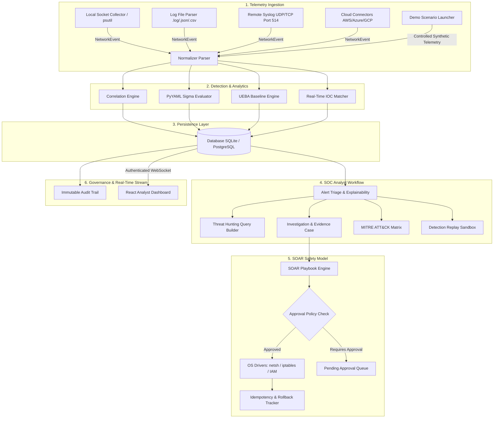

# NETWATCH — Enterprise Defensive SIEM, UEBA & SOAR Platform

NetWatch is an enterprise-oriented defensive SIEM, UEBA, Threat Hunting, MITRE ATT&CK Mapping, Detection Replay, Incident Evidence, Audit Logging, and automated incident response platform built with **FastAPI (Python)**, **SQLAlchemy**, **React (TypeScript)**, **Vite**, and **Tailwind CSS**.

---

## Executive Summary & Value Proposition

> **NetWatch bridges live network telemetry and log streams with explainable rule detection, statistical behavioral baselining, threat hunting, and approval-gated automated response actions.**

NetWatch processes **real network telemetry and real log streams**. It does NOT generate fake alerts, synthetic mock data, or fabricated integration responses. Every alert, anomaly, threat intelligence hit, threat hunt result, and automated response action is grounded in verified system data and deterministic mathematical logic.

---

## Verified Portfolio Status

- **Backend Automated Test Suite:** `50/50 PASSED` (`cd backend; python -m pytest tests/ -v`)
- **Frontend Production Build:** `SUCCESSFUL` (`cd frontend; npx vite build`)
- **API Specification:** Interactive Swagger docs at `http://localhost:8000/docs`
- **Authentication & Security:** JWT OAuth2 Bearer Tokens, Bcrypt Hashing, RBAC Middleware (`ADMIN`, `ANALYST`, `VIEWER`), Last-Admin Protection.

---

## Core Capabilities Overview

### 1. Telemetry Ingestion & Normalization
- **Passive Local Socket Telemetry**: Observes live system socket connections using `psutil` without artificial network probes or synthetic traffic.
- **Log Ingestion Engine**: Structured parser accepting `.log`, `.txt`, `.json`, `.ndjson`, and `.csv` log files, normalizing fields into unified `NetworkEvent` records with path traversal and 10 MB file size safeguards.
- **Syslog Receiver**: Non-blocking UDP/TCP Syslog listener on Port 514 supporting RFC 3164 and RFC 5424 formats.

### 2. Defensive Detection & Rule Engine
- **Correlation Engine**: Evaluates events over sliding time windows, calculates evidence-backed risk scores (0–100), and deduplicates repeated alerts using 300s window hashes.
- **Sigma Rule Engine**: Imports PyYAML Sigma rules, validates syntax (`VALID`, `UNSUPPORTED`, `INVALID`), maps attributes (`src_ip`, `dst_ip`, `Image`, `CommandLine`, etc.), and evaluates logical conditions (`selection`, `wildcards`, `regex`).

### 3. Threat Hunting & Query Engine
- **Structured Search**: Query telemetry and alerts by time range, event category, severity, IP subnet, or custom key-value attributes (`/api/hunting/query`).
- **Hunt Reports**: Save findings into formal Hunt Reports (`/api/hunting/reports`) or pivot directly into new Investigation cases.

### 4. UEBA & Behavioral Anomaly Detection
- **Statistical Baselines**: Calculates baselines over 168-hour windows across network, temporal, entity, and process dimensions (requires min 20 events, returns `INSUFFICIENT_DATA` if unmet).
- **Explainable Anomaly Engine**: Computes deterministic z-scores and percentiles, returning mathematical explanations for every flagged anomaly.

### 5. MITRE ATT&CK Matrix & Coverage
- **Dynamic Matrix Visualizer**: Dynamic heatmap mapping active rules across all 14 MITRE ATT&CK tactics (`TA0001` to `TA0040`), highlighting technique coverage and detection gaps (`/api/mitre/coverage`).

### 6. IOC & Threat Intelligence Framework
- **Real-Time Matcher**: Evaluates IPv4, IPv6, domain, URL, MD5, SHA1, SHA256, and email IOCs against incoming telemetry.
- **Provider Adapters**: Modular integration framework for AbuseIPDB, AlienVault OTX, MISP, and manual threat lists with sliding-window reputation caching.

### 7. Investigation & Evidence Management
- **Case Management**: Triage queue, analyst notes, verdict tracking (`TRUE_POSITIVE`, `FALSE_POSITIVE`), and interactive event timeline generation (`/api/investigations`).
- **Forensic Evidence Attachments**: Attach log extracts, PCAP hashes, and raw payloads directly to cases (`/api/investigations/{id}/evidence`).

### 8. Detection Replay Sandbox
- **Historical Replay**: Replay raw historical telemetry against updated or experimental detection rules to measure performance and tune false positives (`/api/detection/replay`).

### 9. SOAR Subsystem & Response Safety
- **Playbook Engine**: Ordered, multi-step execution with retries, timeouts, and max loop depth safeguards (limit 5).
- **Approval Gate & Safety**: Destructive actions require explicit human authorization (`ANALYST_APPROVAL` or `ADMIN_APPROVAL`). Protected loopback allowlist prevents self-lockouts.
- **Dry-Run & Rollback**: Test actions safely (`NETWATCH_SOAR_DRY_RUN=true`) and perform reversible state rollbacks (`BLOCK_IP` ↔ `UNBLOCK_IP`).

### 10. Immutable Audit Logging
- **Append-Only Trail**: Complete, filterable audit log tracking analyst actions, rule modifications, case updates, and SOAR execution events (`/api/audit`).

---

## Architecture Diagram



---

## Complete SOC Analyst Workflow

```
TELEMETRY
    ↓
NORMALIZATION
    ↓
DETECTION
    ↓
ALERT
    ↓
TRIAGE
    ↓
INVESTIGATION
    ↓
THREAT HUNTING
    ↓
MITRE ATT&CK
    ↓
IOC ENRICHMENT
    ↓
CONTROLLED RESPONSE
    ↓
AUDIT
    ↓
INCIDENT REPORT
```

---

## Controlled Laboratory Demo Scenarios

NetWatch includes 5 controlled, offline laboratory scenarios for demonstration and testing purposes. These scenarios stream synthetic telemetry into local memory/database without targeting external systems:

1. **`ssh_brute_force`** (Primary Demo): Rapid SSH authentication failures followed by successful intrusion on Port 22.
2. **`suspicious_login`**: Off-hours authentication attempt from an anomalous geographic region.
3. **`c2_beacon`**: Periodic outbound HTTP GET requests matching C2 beacon timing patterns.
4. **`port_scan`**: Sequential TCP connection attempts across multiple ports on a single host.
5. **`dns_anomaly`**: High-entropy DNS queries indicating potential covert tunnel or exfiltration.

---

## Technology Stack

- **Backend Framework:** Python 3.10+, FastAPI, Uvicorn
- **Database & ORM:** SQLite / PostgreSQL, SQLAlchemy ORM
- **Rule Engine & Validation:** PyYAML, Pydantic v2
- **Frontend Framework:** React 18, TypeScript, Vite, Tailwind CSS
- **Visualization:** Recharts, Lucide Icons
- **Real-Time Communication:** WebSockets (`/ws/events`)
- **Testing:** Pytest, pytest-asyncio, HTTPX

---

## System Requirements & Installation

### Prerequisites
- Python 3.10+
- Node.js >= 18.0.0, npm >= 9.0.0
- Git

### Installation Steps

1. **Clone Repository & Setup Virtual Environment**:
   ```bash
   git clone https://github.com/koppineeedi/NetWatch-Network-Security-Monitoring-Suspicious-Activity-Detection-Platform.git netwatch
   cd netwatch
   python -m venv venv
   .\venv\Scripts\Activate.ps1   # Windows PowerShell
   # source venv/bin/activate    # Linux / macOS
   pip install -r backend/requirements.txt
   cp .env.example .env
   ```

2. **Initialize Database & Seed Admin Account**:
   ```bash
   python -m backend.app.scripts.create_admin
   python backend/app/scripts/config_check.py
   ```

3. **Build & Test Frontend**:
   ```bash
   cd frontend
   npm install
   npx vite build
   cd ..
   ```

4. **Start Backend API Server**:
   ```bash
   cd backend
   python -m uvicorn app.main:app --host 0.0.0.0 --port 8000 --reload
   ```

- REST API Base URL: `http://localhost:8000`
- Interactive Swagger Specs: `http://localhost:8000/docs`
- Health Probe: `http://localhost:8000/health`
- Frontend Development Server: `http://localhost:5173`

---

## Automated Test Verification

Run the complete backend test suite:
```bash
cd backend
python -m pytest tests/ -v
# Output: 50 passed in 17.22s
```

Run the production frontend build:
```bash
cd frontend
npx vite build
# Output: ✓ 1510 modules transformed
```

---

## Project Screenshots & UI Checklist

Refer to [docs/SCREENSHOT_GUIDE.md](docs/SCREENSHOT_GUIDE.md) for full capturing instructions. Recommended screens:

1. **Analyst Dashboard** (`/`)
2. **Alert Triage Queue** (`/alerts`)
3. **Alert Explainability Modal** (Modal View)
4. **Threat Hunting Builder** (`/hunting`)
5. **Investigation Case & Evidence** (`/investigations/{id}`)
6. **MITRE ATT&CK Matrix** (`/mitre`)
7. **Sigma Sandbox & Rules** (`/rules`)
8. **SOAR Approvals & Dry-Run** (`/soar`)
9. **Immutable Audit Logs** (`/audit`)
10. **Incident Summary Report** (Export View)

---

## Technical Documentation & References

- [3-Minute SOC Demo Presentation Script](docs/DEMO_SCRIPT.md)
- [Technical Interview & Architecture Cheat Sheet](docs/INTERVIEW_GUIDE.md)
- [Visual Screenshot Guide](docs/SCREENSHOT_GUIDE.md)
- [System Architecture](docs/ARCHITECTURE.md)
- [Threat Model Specification](THREAT_MODEL.md)
- [Security Hardening Guide](docs/SECURITY_HARDENING.md)

---

## Known Limitations & Production Roadmap

- **Database Storage:** Default SQLite storage is ideal for single-instance testing. Production deployments should use PostgreSQL with connection pooling.
- **Horizontal Scaling:** High-volume multi-gigabit log ingestion requires replacing the in-process queue with Apache Kafka or RabbitMQ.
- **External Connectors:** Cloud Connectors (AWS/Azure/GCP) and Threat Intelligence APIs default to `NOT_CONFIGURED` until active credentials are set in `.env`.

---

## Technical Portfolio & Interview Summary

NetWatch was designed as a production-grade defensive security engineering project to demonstrate mastery in SIEM telemetry parsing, rule correlation, UEBA anomaly detection, threat hunting, dynamic MITRE ATT&CK mapping, SOAR safety model design, and REST/WebSocket API development. All 50 backend tests pass cleanly, and the frontend builds with zero errors.

---

## License & Defensive Operations Policy

This software is strictly intended for defensive cybersecurity operations, security monitoring, threat detection, and authorized educational laboratory research.
