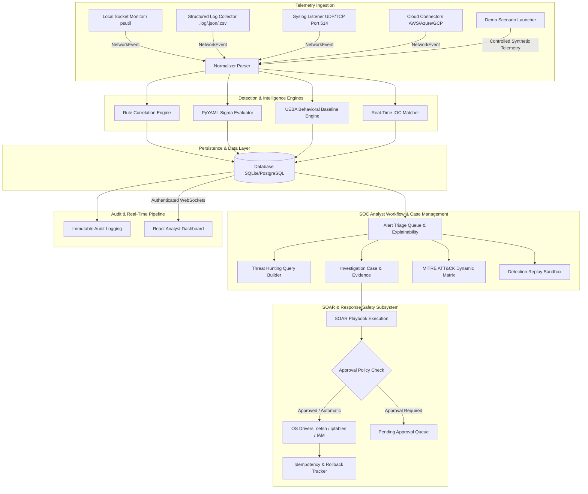

# NETWATCH — System Architecture & Component Design

## Overview
NetWatch is a defensive SOC, SIEM, UEBA, and network security monitoring platform designed to ingest security telemetry, detect suspicious behavior, support threat hunting and incident investigation, map detections to MITRE ATT&CK, investigate indicators, and execute controlled response workflows.

## End-to-End SOC Telemetry Workflow

```
TELEMETRY (Socket / Syslog / Log Ingestion / Connectors / Safe Demo Scenarios)
    ↓
NORMALIZATION (Unified NetworkEvent Schema & Attribution)
    ↓
DETECTION (Rule Engine / Sigma Live / UEBA Z-Score Anomaly Engine)
    ↓
ALERT (Deduplicated Security Alerts with Risk Scores)
    ↓
TRIAGE (Analyst Triage Queue & "Why Did Alert Fire?" Explainability)
    ↓
INVESTIGATION (Case Management, Evidence Attachment, Real Timeline)
    ↓
THREAT HUNTING (Structured Filter Queries & Pivot Analysis)
    ↓
MITRE ATT&CK MAPPING (Dynamic 12-Tactic Enterprise Matrix Coverage)
    ↓
IOC ENRICHMENT (Reputation Caching & Real-Time IOC Matching)
    ↓
INCIDENT RESPONSE (Controlled SOAR Playbooks, Approvals & Rollback)
    ↓
CASE RESOLUTION (Final Verdict & Auditor Sign-off)
    ↓
INCIDENT REPORT (Redacted Exportable Incident Summary)
```

## System Architecture Diagram



## Component Architecture

```
+-------------------------------------------------------------+
|                      React 18 Frontend                      |
| (Vite + TypeScript + Tailwind CSS + Recharts + Lucide Icons)|
+-------------------------------------------------------------+
                              |
                     REST API / WebSockets
                              |
+-------------------------------------------------------------+
|                    FastAPI Python Backend                   |
|  - Collectors (local_network, syslog_collector, connectors) |
|  - Parsers & Normalizers (syslog, json, csv)                |
|  - Detection & Sigma Rule Engine                            |
|  - Threat Hunting, Replay & Evidence Services               |
|  - SOAR Subsystem & Approval Engine                         |
+-------------------------------------------------------------+
                              |
                       SQLAlchemy ORM
                              |
+-------------------------------------------------------------+
|                 Database (SQLite / PostgreSQL)              |
|  Tables: network_events, alerts, detections,                |
|  investigations, incident_evidence, threat_hunt_reports,    |
|  sigma_rules, soar_playbooks, audit_logs                    |
+-------------------------------------------------------------+
```

## Data Lifecycle & Source Attribution
Every security event processed by NetWatch is attributed with an explicit `source` tag:
- `LOCAL_NETWORK`: Direct system socket connection telemetry (`psutil`).
- `LOCAL_SYSTEM`: Local OS system telemetry.
- `WINDOWS_EVENT`: Windows Security Log Events.
- `LOG_FILE`: Uploaded raw log files (.log, .json, .csv).
- `SYSLOG_514`: Remote Syslog UDP/TCP receiver.
- `SURICATA`: Suricata EVE JSON telemetry.
- `ZEEK`: Zeek connection log telemetry.
- `TEST`: Clearly labeled safe synthetic lab test data.

## Defensive Security & Privacy Safeguards
- 100% Defensive: No automated attacks, password spraying, or exploits.
- Monitored scope restricted strictly to authorized local machine sockets, remote syslog feeds, and explicitly provided log files.
- Controlled SOAR execution with manual approval workflow and safe rollback capability.
